# Curso:  
## Flutter & Dart - The Complete Guide [2021 Edition]
# Plataforma:
## udemy

## 01/09/21:

## Sección 1: Introduction

### 1. Introduction
Explica en que consistirá el curso y habla de que se van a tener que programar aplicaciones durante el transcurso del mismo.

### 2. What is Flutter?	
Explica que Flutter es una herramienta que permite programar aplicaciones multiplataforma de manera nativa para cada una de estas en un mismo lenguaje, Dart. 
Habla de las ventajas de esto, como programar solamente una vez para las diferentes plataformas o aprender un solo lenguaje.
Flutter tiene un SDK que permite compilar para las diferentes plataformas. Además, proporciona un framework que se usará para crear las aplicaciones. 
También explica que Dart es un lenguaje enfocado en la creación, de manera sencilla, de frontends, orientado a objetos, tipado y su sintaxis es una mezcla de Javascript, Java y C#.

### 3. Join our Online Learning Community	
Texto donde anima a unirse a un canal de Discord para formar parte de una comunidad.

### 4. Understanding the Flutter Architecture
Habla de la estructura basada en widgets de Flutter, de como esta se programa solamente con código (no visualmente) y de que se puede crear código para que cuando la aplicación se compile para Android actue de una manera y cuando se compile para iOs de otra.
Una aplicación está basada en un árbol de widgets en donde unos contienen a otro, donde los últimos widgets puede ser los botones, entradas de texto… 
Aunque no se pueda programar “arrastrando” de manera visual widgets, si que puedes ver una vista previa del código. 

### 5. How Flutter & Dart Code Gets Compiled To Native Apps
Habla de lo anteriormente comentado, de que flutter compila el codigo para las diferentes plataformas y especifica que las aplicaciones tienen un alto rendimiento.
Flutter no compila su codigo con alguna equivalencia nativa de las plataformas (por ejemplo poniendo un boton en flutter no se llama al boton de ios, o android), controla cada pixel y esto da mucho control y flexibilidad sobre lo que se quiere programar. 

### 6. Understanding Flutter Versions
Habla de que flutter se actualiza constantemente para arreglar errores, mejoras o también algunos cambios que ni si quiera el programador aprecia.

### 7. Flutter macOS Setup

### 8. macOS Development Environment
No dispongo de equipo para seguir estas explicaciones.

### 9. Flutter Windows Setup
Siguiendo las instrucciones de esta web explica como instalar Flutter: https://flutter.dev/docs/get-started/install/windows

## 06/09/21:

### 10. Windows Development Environment
Explica como crear un proyecto de Flutter a través de la consola, como instalar vs code, las extensiones que hay que instalar para programar comodamente y como abrir el proyecto.
Deja un par de archivos de configuración en la carpeta recursos para así poder tener configurado el proyecto de la misma manera que el curso.
Explica como ejecutar el proyecto en el emulador AVD de android a través del terminal y a través de VS CODE. 
También explica como ver los cambios "en caliente" de las dos maneras.

### 11. Flutter & Material Design
Habla de flutter utiliza mucho Material Design, que es de Google, pero que material design también se puede usar con apple y que también enseñara a utilizar las herramientas de apple.

### 12. Flutter Alternatives
Compara Flutter con React Native y a su vez con Ionic. De manera resumida cuenta que la gran ventaja de Flutter es el hecho de que las aplicaciones se compilen para ser nativas en cada dispositivo y la flexibilidad y eficiencia que da esto a las mismas.

### 13. Course Outline
Habla de la estructura del curso y de lo que se va a estudiar.

### 14. How To Get The Most Out Of The Course
Aconseja como llevar el curso. (A tu ritmo, programando tu solo, preguntando y ayudando a la comunidad...)

## 09/09/21

## Sección 2: Flutter Basics [QUIZ APP]

### 16. Module Introduction
Habla de que esta sección va a ser larga ya que debe ajustarse a los programadores más expertos y los novatos. 
En esta sección veremos:
1. Como una app Flutter se inicia y funciona.
2. Trabajaremos con widgets y crearemos widgets personalizados.
3. Como reaccionar ante eventos del usuario.
4. Diferencia entre widgets con estado y widgets sin estado.
5. Fundamentos de Dart.

### 17. Creating a New Project
Creamos un proyecto a través de la consola de comandos. Explica como se crea y ejecuta un proyecto de flutter desde vs code (de nuevo).

### 18. An Overview of the Generated Files & Folders 
Explica la funcionalidad de cada una de las carpetas generadas por flutter al crear el proyecto. La mayoría como "Android", "build" o "ios" son pasivas y no debemos cambiar nada en ellas. Sin embargo "lib" es donde programaremos y "test" es una carpeta que usaremos en el futuro para hacer pruebas. "pubspec.yaml" es donde administraremos las dependencias del proyecto como paquetes de terceros, imagenes o tipografías.  

### 19. More on Git (Version Control System)
Contiene un link donde ver aprender para que sirve y como funciona git.

### 20. Analyzing the Default App
Explica con el codigo que todo son widgets, que hay widgets creados por flutter y widgets creados por nosotros, y que también podremos combinar widgets. Al final del video borra todo el codigo para que aprendamos dart desde 0.

### 21. Dart Basics
Explica conceptos básicos de dart, como lo que es una función, que es un lenguaje tipado, que la funcion main es la función que usa como entrada a la aplicación, que las funciones para su nomemclatura utilizando camel case, como llamar a funciones, que hay que usar punto y coma despues de cada función... 

## 10/09/21

### 22. More Dart Basics
Explica como crear variables en dart y el uso de 'var'. Explica también que todo en DART es un objeto y como inicializarlos (sin usar new) y cambiar sus propiedades.

### 23. Dart Basics - Summary
Resumen en PDF de los dos modulos anteriores.

### Cuestionario 1: Dart Fundamentals

### 24. Building an App From Scratch
Volvemos a programar en el proyecto que creamos anteriormente y explica lo que es la herencia y los import.Explica como hacer el constructor de un widget basado en material.

### 25. Running the App on an Emulator
Explica como usar la función runApp para llamar a un objeto de la clase creada anteriormente y ver en el emulador la aplicación.

### 26. Class Constructors & Named Arguments
Explica como hacer y para que sirve un constructor y sus argumentos. Explica como funcionan los argumentos con nombres (opcionales), cuando quieres que un argumento opcional sea obligatorio (EN FLUTTER no en DART) tienes que ponerle delante @required. Explica también como hacer un constructor de manera más corta, ej: PErson({this.name,this.age});

### 27. First Summary & Additional Syntax
Resume lo que dimos y explica que opcionalmente se puede poner @override antes de la función sobrescrita para hacer un codigo más limpio.También explica como resumir una función con solo una expresion ej: void main() => runAPP(MyApp());

### Cuestionario 2: Flutter App Basics

### 28. Building a Widget Tree
Explica el objeto Scaffold (que da un diseño básico estructura y esquema de color para una interfaz de usuario). Explica que a Scaffold le podemos pasar widgets de lo que queramos modificar, por ejemplo AppBar a la que a su vez se le pasa un titulo, o un widget body. Explica donde debemos poner ',' para programar de una manera más legible.

## 11/09/21

### 29. Visible (Input / Output) & Invisible (Layout / Control) Widgets
Explica la diferencia entre los widgets visibles que están relacionados con la entrada o salida de datos cara al usuario (botones, textos...) e invisibles donde controlamos cosas como el layout y la estructura de widgets (filas,columnas,Listview..).

### 30. Adding Layout Widgets
Explica el concepto de listas en Dart, como meter una lista de widgets dentro de un widget del tipo columna, y como hacer botones con el widget RaisedBoton.

### Cuestionario 3: Widget Basics

### 31. Connecting Functions & Buttons
Explica como conectar las funciones con los botones, básicamente en el Onpressed: se llaman sin parentesis, si no se ejecutarian en el momento.

### 32. Anonymous Functions
Explica como programar funciones anonimas: si son simples "() => print("HOLA")" si la función usa varias lineas se usan los corchetes "(){print("HOLA");print("Esto es otra linea de codigo");}

### 33. Updating Widget Data (Or: Using StatelessWidget Incorrectly)
Explica como NO cambiar el texto a través de un boton :rage: :shit:

## 20/09/21

### 34. [DART DEEP DIVE] Understanding Lists
Explica el concepto de listas.	

### 35. Updating Correctly with Stateful Widgets
Explica lo que es el estado de un widget y cual es la diferencia entre un widget con estado y uno sin. También explica como programar y enlazar un widget con estado. 

### Cuestionario 4: Stateful & Stateless Widgets

### 36. A Brief Look Under The Hood
Explica como funciona internamente la función SetState().

### 37. Using Private Properties
Explica los niveles de acceso a las propiedades desde los otros archivos/librerias (el concepto de privado) 
Para convertir una propiedad o clase en privada en dart se le pone una barra baja antes del nombre ej: 
variable1 sería publica _variable1 sería privada.

### 38. Creating a New, Cuestom Widget
Explica como hacer una clase widget y acceder a ella desde otra clase.

### 39. First Styling & Layouting Steps
Explica algunas propiedades de estilo que se le pueden pasar al constructor de un text, lo que es una enumeración, que puede haber diferentes tipos de constructores...

### 40. Enums & Multiple Constructors 
Explica de manera más extendida lo que es una enumeración y la posibilidad de usar multiples constructores en dart.

### 41. Official Docs & The Widget Catalog
Explica la utilidad de la documentación de Flutter y donde encontrarla.

### 42. Styling Buttons & Passing Callback Functions Around
Explica como usar el RaisedButton en vez del ElevatedButton.

### 43. Passing Callback Functions Around 
Explica como pasar una función en un constructor. Además hacemos nuestro propio widget "Answer".

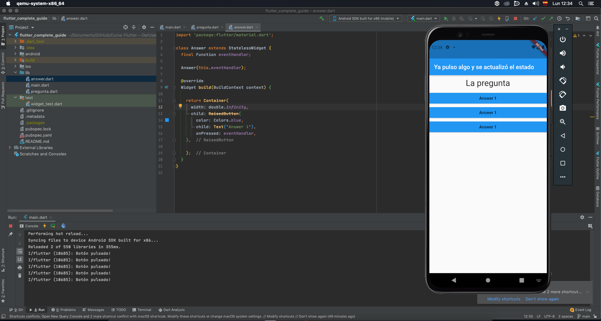

### 44.Introducing Maps
Explica como funcionan los mapas de datos en dart. (Funciona como un hash map clave-valor).

### 45. Mapping List to Widgets
Explica como transformar la lista de preguntar y respuestas en widgets de tipo answer y question, creados anteriormente dinamicamente.

### 46. final vs const
Explica el uso que debemos dar a 'final' y 'const' y como las trata dart.

### Cuestionario 5: Advanced Flutter & Dart Basics
![](capturas/cuestionario5.png

### 47. Introducing "if" Statements
Explica los 'ifs' y las booleanas.

### 48. [DART DEEP DIVE] More on "if" Statements
Explica de nuevo más profundamentos como funcionan las condiciones y las booleanas.

### 49. [DART DEEP DIVE] The "null" Value & Null Safety
Explica el valor null y el modo en el que se puede trabajar comprobando que las variables no van a ser null. 

###  50. Outputting Widgets Conditionally
Explica como hacer ternarias y como implementarlas en la APP que estamos haciendo. 

### 51. Splitting the App Into Widgets
Habla de la importancía de tener un codigo limpio y los widgets cada uno en su propia clase, lo hace con el ejemplo de aplicación.

### 52. Calculating a Total Score
Explica como aignar una puntuación a cada una de las respuestas de la App y como hacer un variable que vaya contando esa puntuación.

### 53. Getters & "else-if"
Explica el funcionamiento de los "else-if" y de los "captadores" "get" y como se usan en dart, ej: 
String get frase { return "hola";
}

### 54. Resetting the Quiz
Explica como poner una nueva columna para así poner un texto debajo de un botón para reiniciar la aplicación.

### 55. "Old" Button Widgets vs "New" Button Widgets
Explica que en el curso se siguen utilizando los viejos botones porque aunque estén deprecados aun hay mucho codigo con ellos. Comenta también las ventajas de los nuevos botones. También explica como migrar de los botones viejos a los nuevos. 

### 56. Wrap Up
Resume lo dado en esta sección 

### 57. Module Resources
Recursos: links de interes, de documentación oficial y el codigo realizado en este modulo.

## Sección 3: Running Apps on Different Devices & Debugging Apps

### 58. Module Introduction
Hace un resumen de lo que se dará en este modulo:
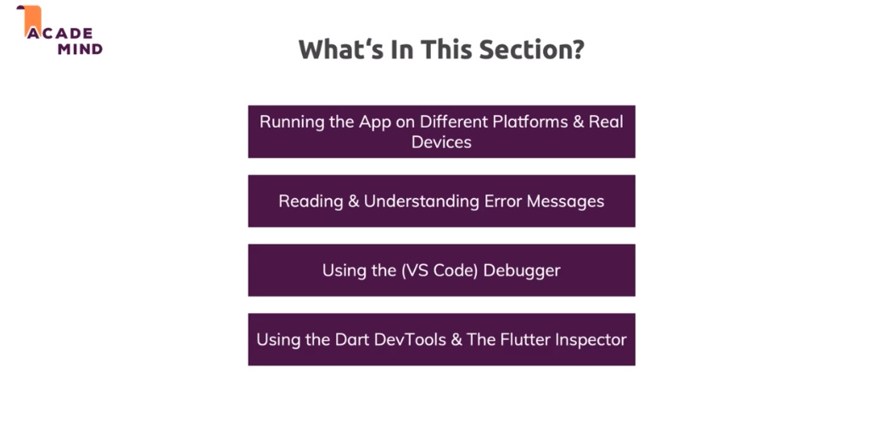

### 59. Running the App on a Real Android Device
Explica como probar la aplicación en un dispositivo Android conectado al pc.

### 60. Running the App on an iOS Emulator
Explica como abrir a través de Xcode la app que hemos creado en un emulador de iOs.

### 61. Running the App on a Real iOS device
Explica como ejecutar la aplicación creada en un dispotivo iOS conectado a nuestro mac.

### 62. Working with the Emulators / Using the Emulators
Explica algunas de las caracteristicas de los emuladores.

### 63. Understanding Error Messages & Fixing Errors
Habla de los errores más comunes, como los errores de sintaxis o las excepciones durante la ejecución y como detectarlos. 

### 64. Using the Debugger
Explica como usar el debugeador incluido en Visual Studio.

### 65. Getting Started with the Dart DevTools
Explica como abrir las herramientas de desarollo de dart y como empezar a sacarles provecho.

### 66. Understanding the Repaint Rainbow
Explica en que consiste la herramienta de "repaint rainbow". Basicamente sirve para que marque que elementos en pantalla han cambiado/se han repintado.

### 67. Wrapping up the Dart DevTools
Explica como usar otras de las herramientas que proporciona Dart para depurar como la linea de tiempo o el consumo de memoria. 

### 68. Useful Resources & Links 
Como todos los finales de secciones aporta enlaces a documentación y aporta recursos vistos en la clase. Dejo un ejemplo de esta pantalla ya que se repetirá más veces:

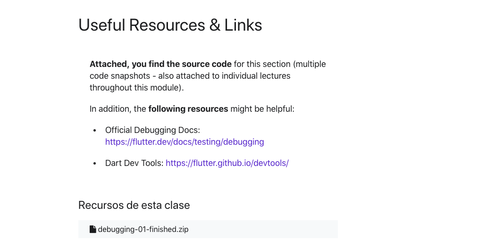

## Sección 4: Widgets, Styling, Adding Logic - Building a Real App [PERSONAL EXPENSES APP]

### 69. Module Introduction
Introducción a lo que se estudiará en este modulo y a la app que se hará.

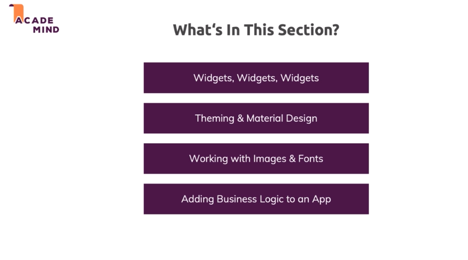

### 70. An Overview of the Core Flutter Widgets
Un pequeño resumen de los widgets más importantes de flutter en los que durante el curso iremos indagando más y conociendolos mejor.

### 71. Planning the App
Planifica y explica como será la app que desarollaremos en esta sección, este ejemplo es útil para ver la importancia de la planificación y visualizar lo que se hará antes de empezar.

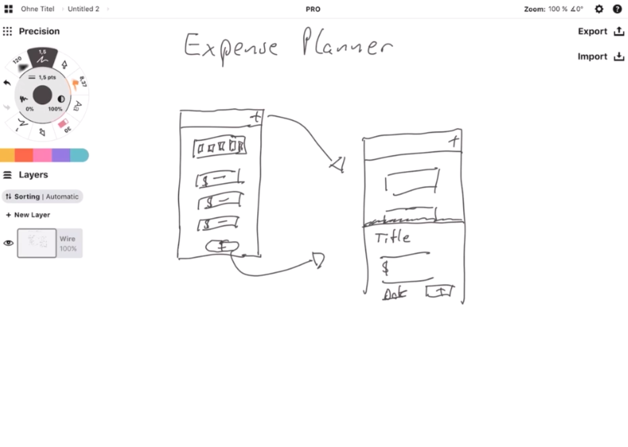

## 21/09/21

### 72. Combining Widgets
Creamos un par de widgets tipo Card en la nueva aplicación que estamos desarollando y vemos como se comporta el ancho de la misma al meterla dentro de otro widget tipo container y darle tamaño o darle tamaño al widget "hijo" del card.

### 73. Understanding Column Alignment
Explica algunas propiedades de las columnas y filas.

### Cuestionario 6: Columns & Rows
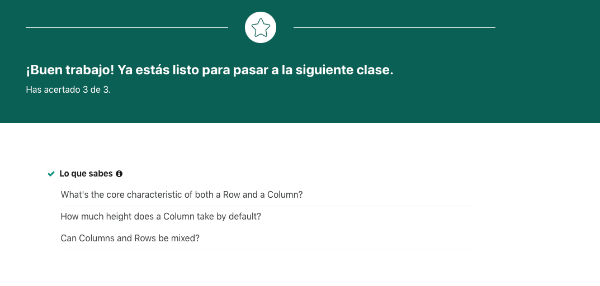

### 74. Not a Widget: Adding a Transaction Model & Transaction Data
Hacemos el modelo de transacciones y hacemos una lista de transacciones.

### 75. Mapping Data Into Widgets
Hacemos un mapeo de la lista de transacciones a widgets tipo Card.

### 76. Building a Custom List Item
Formateamos la carta de cada una de las transacciones de modo que incluya todos los datos de una manera ordenada.

### 77. Styling a Container
Damos estilo al contenedor de los precios.

### 78. Styling Text
Damos estilo al texto de los precios ( negrita, tamaño de fuente, color)

### 79.More Styling
Damos estilo al texto de titulo del gastos y al de fecha.

### Cuestionario 7:Styling Time! 
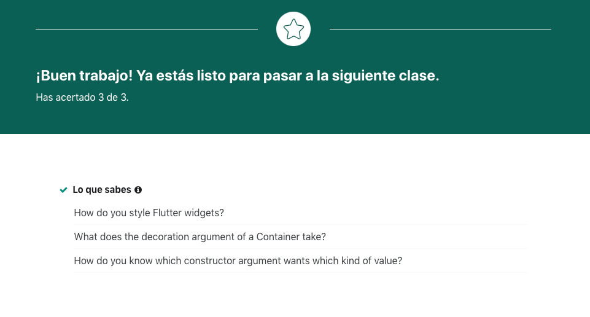

### 80. Containers vs Columns vs Rows
Explica las diferencias entra las columnas las filas y los contenedores y enima a combinarlos ya que cada uno tiene sus ventajas y posibilidades.
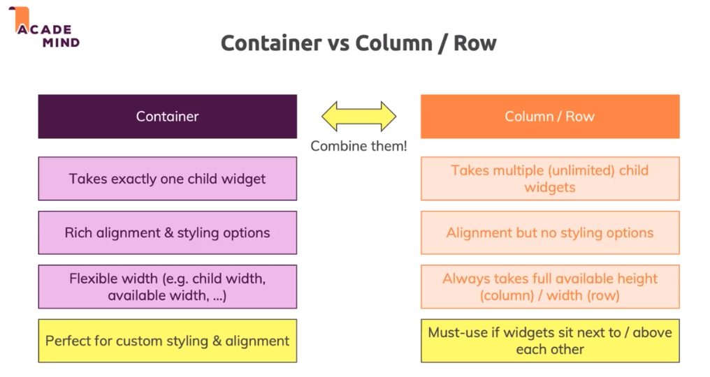

### 81. Using String Interpolation
Explica como se interpolan de una manera comoda en Dart los Strings.

### 82. Installing External Packages & Formatting Dates
Explica como instalar el paquete externo de formatear fechas y lo usamos en la fecha de la app.

### 83. DateFormat Patterns
Aporta un documento donde indica patrones de formatos de fecha para el paquete intl previamente instalado.

### 84. Adding Text Input Widgets (TextField)
Añadimos y formateamos el widget tipo campo de texto.

### 85. Fetching User Input
Explica como coger los datos de los inputs de texto.

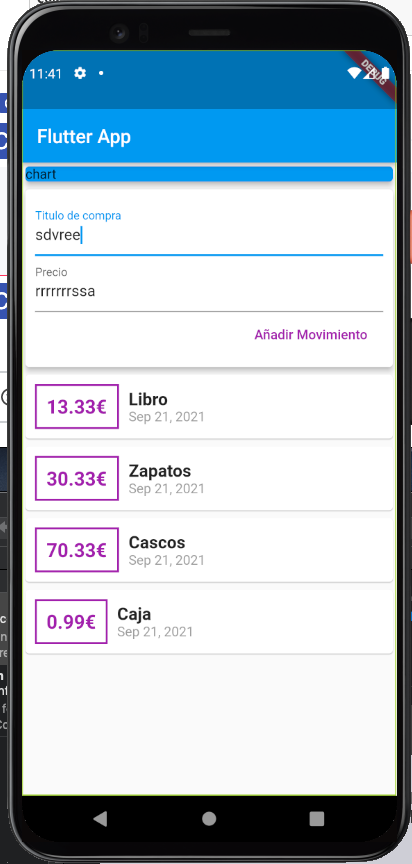

### 86. Splitting the App Into Widgets
Explica como modularizar correctamente los modelos y widgets para tener todo el codigo más limpio y ordenado.

### 87. Connecting Widgets & Managing Data / State
Añadimos una función para meter nuevas transacciones y actualizar el estado.

### 88. Adding User Transactions to the List
Hacemos que el botón añada a la lista un nuevo gasto.

### 89. Making the List Scrollable!
Hacemos que se pueda scrollear en la lista de gastos.

### 90. Working with ListViews
Enseña como cambiar el widget tipo column por un ListView, y dos maneras de usar el ListView, pasandole los widgets children en el constructor o a través de la función builder que para listas con más datos se vuelve más eficiente al no tener cargado todo todo el rato en la memoria.

### Cuestionario 8: Lists, Scrolling & Text Input
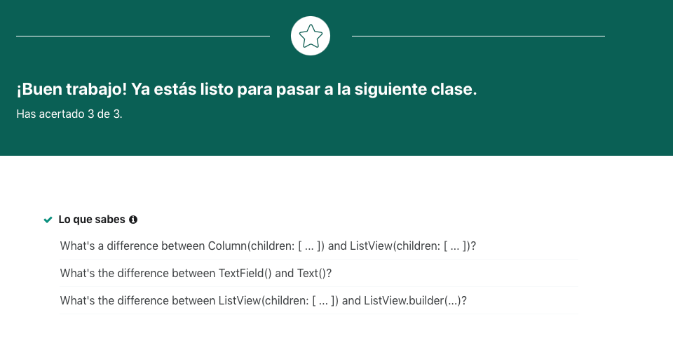

### 91. Further Input & Output Styling and Configuration
Cambiamos propiedades de los inputs y de como muestra el texto.

### 92. Adding AppBar Buttons & Floating Action Buttons
Añadimos un botón a la barra superior de la app y un botón flotante.

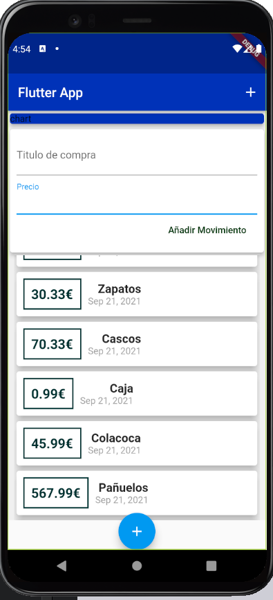

### 93. Showing a Modal Bottom Sheet
Hacemos que la parte de añadir una nueva transacción sea modular y se abra al pulsar los botones de +.

### 94. Improving & Styling the Modal Bottom Sheet
Mejoramos la parte modulada de añadir transacción haciendo que se cierre al añadir transación. 

### 95. Configuring & Using Themes
Explica como usar los temas en tu APP y como pasar los datos a las otras pantallas.

## 22/09/21

### 96. Custom Fonts & Working with Text Themes
Explica como añadir fuentes al proyecto mediante la modificación del archivo pubspec.yaml y como modificar los temas de los textos.

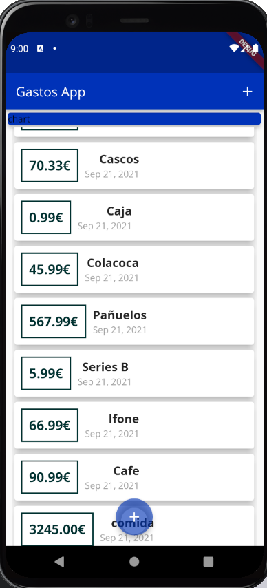

###  97. Updated Text Theme Properties

### Cuestionario 9: Theming
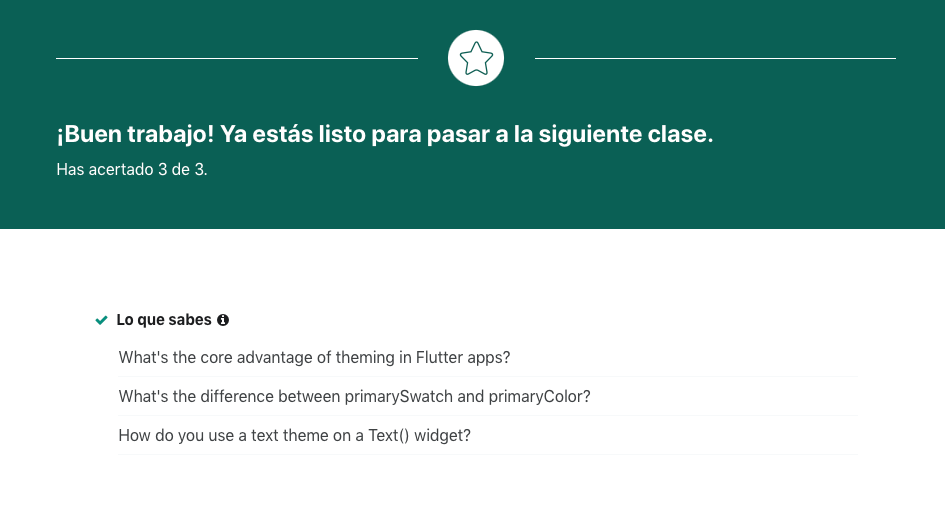

### 98. Adding Images to the App
Explica como añadir imagenes a la aplicación (igual que las fuentes hay que especificarlos en el archivo pubspec) y como hacer que se adapten al tamaño que nos interese.

### 99. Planning the Chart Widget
Plánifica como será nuestro widget de gráficos.

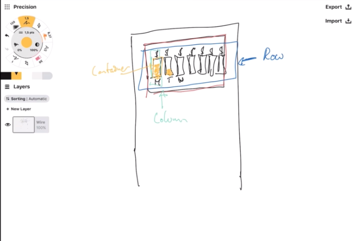

### 100. Looping Through Lists
Haciendo un bucle for para conseguir sumar el dinero gastado cada día de la semana para nuestro widget de gráficos.

### 101. More on "for" Loops
Documento donde explica los for extendidos.

### 102. Deriving Recent Transactions
Explica como mandar los datos de las transacciones recientes al widget de gráfico.

### 103. Creating Bars for our Chart
Creamos otro widget para que genere las barras de los gráficos. 

### 104. Populating the Chart with Values
Implementamos la barra de gráficos. 

### 105. Finishing the Chart Bars
Aprendemos lo que son los widgets Felxible y FittedBox. Damos unos retoques a el diseño de los gráficos.

### 106. Flexible & Expanded: Deep Dive
Explica más en profundidad el widget flexible y como lo podemos usar para diseñar. También explica brevemente el widget expanded, que tiene un funcionamiento muy parecido al flexible.

### 107. Adding a ListTile Widget
Explica como funciona el widget ListTile que basicamente es como una plantalli para crear listas.

### 108. Improving the Overall Chart
Explica como cambiar el orden de los días de la semana y como alinear las gráficas en caso de que haya números demasiado grandes.

### 109. Widgets & Configuring Widgets - Summary / Overview
Hace un resumen de los widgets estudiados en las últimas lecciones y explica como algunos widgets son super similares a otros pero con ligeros cambios para adaptarse a funciones más concretas y como es interesante estudiar los widgets que hay ya que puedes encontrar algunos que te hagan resolver tu trabajo de un modo más sencillo.

### 110. Getting Started with Date Selection
Empezamos a preparar el selector de fechas en la ventana modal.

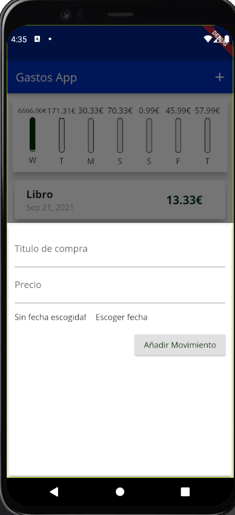

### 111. Showing a DatePicker
Nos enseña como hacer una función que llama al showDatePicker.

### 112. Adding Transactions with a Date
Explica como pasar la fecha a la función agregarTransaccion.

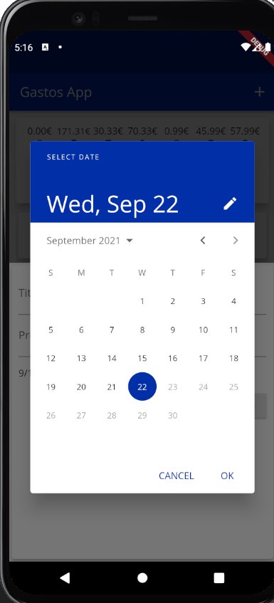

### 113. Deleting Transactions & Using IconButtons
Nos enseña como borrar una transacción y como usar el widget IconButtons.

### 114. Final Polishing!
Explica como la App no es adaptativa y como en la siguiente sección daremos como hacerla responsive.

### 115. Wrap up
Hace un pequeño resumen de los aprendido en esta sección:

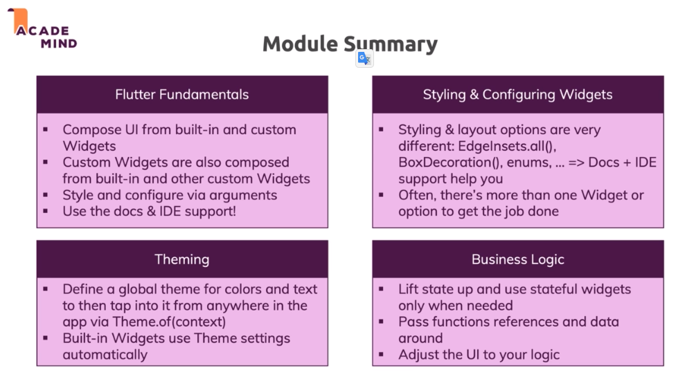

### 116. Useful Resources & Links
Links de interes.

## Sección 5: Responsive & Adaptive User Interfaces and Apps

### 117. Module Introduction
Resume lo que se dará en el modulo.

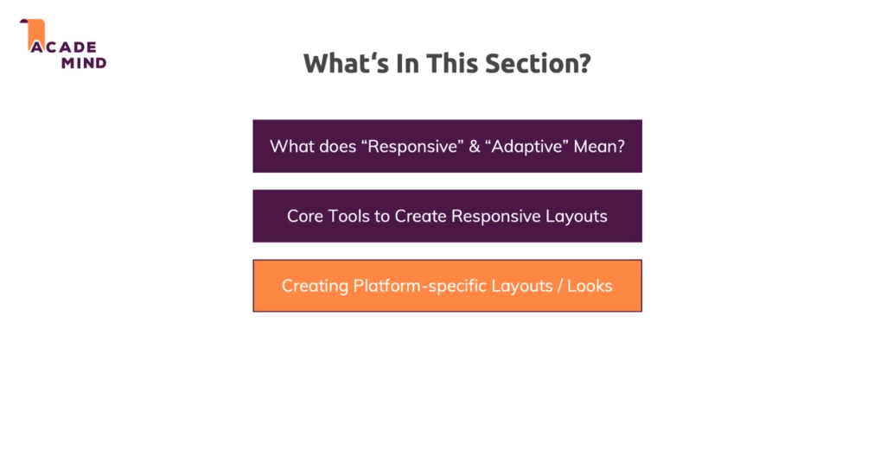

### 118. What does "Responsive" and "Adaptive" Mean?
Habla de como habrá usuarios que utilicen la aplicación en modo vertical, otros en modo horizontal y en diferentes dispositivos. Además los dispositivos Android e Ios cada uno tienen sus 'looks', sus animaciones, sus tipografías, su estilo. 

### 119. Examples: Where we could improve the App! 
Busca detalles respecto a lo hablado en los que podríamos mejorar nuestra aplicación.

## 23/09/21

### 120. Calculating Sizes Dynamically
Explica como calcular dinamicamente el tamaño de los componentes para que no hacerlo con medidas de pixeles y que sea adaptativo mediante funciones como MedyaQuery.of(context).size.

### 121. Working with the "textScaleFactor"
Documento que explica que hay que tener en cuenta el textScaleFactor que basicamente te comunica como el usuario tiene escalado el texto en las preferencias de su dispositivo.

### 122. Using the LayoutBuilder Widget
Usamos el widget layoutBuilder para poder trabajar con constraints. 

### Cuestionario 10: Responsiveness

### 123. Controlling the Device Orientation
Nos enseña como restringir la orientación del dispositivo mediante la inclusión de SystemChrome.setPreferredOrientations([DeviceOrientation.portraitUp]).

### 124. Rendering Alternative Landscape Content - 1
Nos enseña a añadir un objeto tipo switch para elegir en modo landscape si queremos motrar los gráficos o no.

### 125. Finishing Landscape Mode
Explica como hacer que la imagen no se quede super grande en el modo landscape.

### 126. Showing Different Content Based on Device Orientation
Explica como acceder a la información del dispoitivo para saber la orientación del mismo y mostrar de manera diferente la pantalla dependiendo su orientación.

### 127. Respecting the Softkeyboard Insets
Explica como cambiar el formulario modal para que aumente el padding en caso de que haya un teclado en pantalla y así poder activar el scroll y acceder a los parametros que tapa el teclado.

### 128. Using the Device Size in Conditions
Da un ejemplo para nuestra app de como aprovechar mejor el espacio en pantallas más grandes.

### 129. Managing the MediaQuery Object
Al acceder varias veces al objeto MediaQuery estamos haciendo consultas inecesarias, sería mejor guardarlo en un objeto al principio del builder.

### 130. Checking the Device Platform
Explica como algunos widgets tienen una manera de adaptarse al sistema en el que se ejecutan, como el switch poniendole swich.adaptive. También explica como acceder a la información de que plataforma estamos usando y así adaptarse al estilo de dicha plataforma.

### 131. Using Cupertino (iOS) Widgets
Explica como usar algunos de los widgets de iOs para adaptarse más a la plataforma.

### 132. Using the SafeArea
Widget con el cual podemos envolver el body para garantizarnos que esta en el espacio en el que puede estar.

### 133. More Cupertino Styles
Adaptamos nuestra aplicación más al estilo de cupertino.

### 134. Using Cupertino Buttons
Explica como usar los botones de cupertino.

### 135. Creating Custom Adaptive Widgets
Creamos widgets adaptativos para tener el codigo más modularizado ordenado y legible.

### Cuestionario 11: Adaptive Widgets
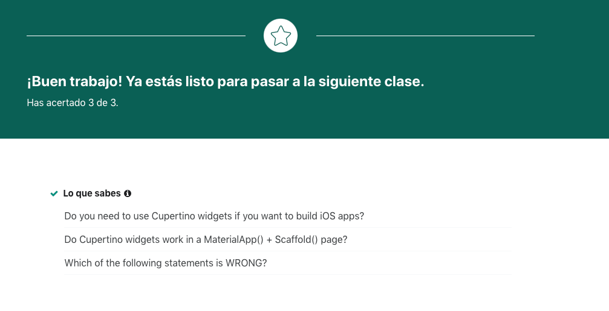

### 136. Wrap Up
Resumen de lo dado en esta sección.

### 137. Useful Resources & Links
Enlaces de interes.

## Sección 6: Widget & Flutter Internals - Deep Dive

### 138. Module Introduction
Habla de lo que se dará en esta seccion: como funcionan flutter de una manera más profunda.

### 139. The Problem At Hand
Flutter funciona a 60 fps, osea que pinta lo que se ve en pantalla 60 veces por segunda, y esto sería un problema de eficiencia si tuviese que calcular lo que tiene que dibujar cada vez, pero si nada cambia no tiene que calcular nada.

### 140. Widget Tree & Element Tree - What, Why and How? 
Hay tres arboles, el de widgets el de elementos y el de render. Tu solo te encargas de controlar el widget tree, los otros los administra flutter internamente basandose en tu widget treee.  Explica cuando se ejecuta la compilación  y cuando se renderiza.

## 27/09/21 

### 141. How Flutter Rebuilds & Repaints the Screen 
Flutter no reconstruye el arbol de elementos al llamar a la función build, sustituye la referencia de los widgets por las referencias de los nuevos widgets comprueba si hay una nueva configuración en estos widgets respecto a los anteriores y en caso de que sea así pasa esa información al arbol de Render para que este renderize/actualice las partes necesarias. 

### 142. How Flutter Executes build()
Explica de manera practica y haciendo prints en el codigo de la aplicación que hemos creado como se ejecutan la función build y los constructores der los widgets.

### 143. Using "const" Widgets & Constructors
Explica como hacer const los objetos inmutables mejora sutilmente la eficiencia de nuestra aplicación.

### Cuestionario 12: Widgets, Elements, build()
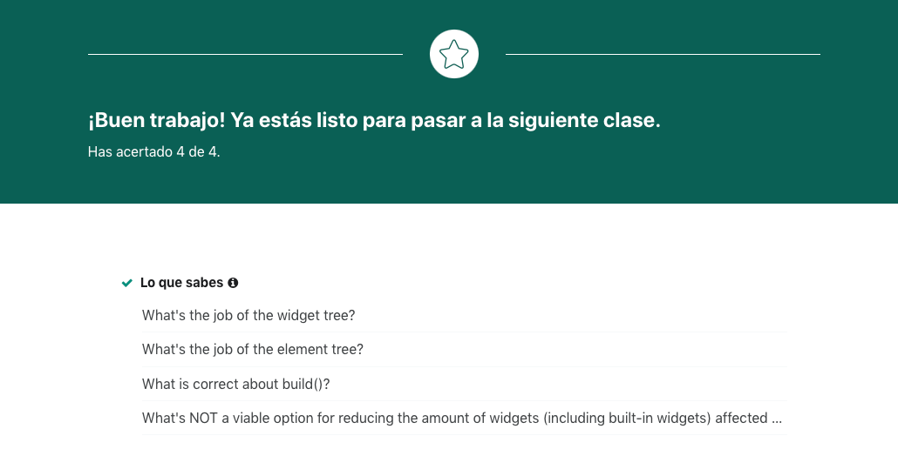

### 144. Writing Good Code
Habla de como a veces es más importante la legibilidad del codigo que el rendimiento. 

### 145. Extracting Widgets
Explica como extraer un widget a otra clase, utiliza la aplicación que creamos para hacerlo.

### 146. Using Builder Methods
Explica como crear builders de widgets para darle más legibilidad al codigo. También explica el operador de propagación "..." que lo que hace es "descomponer" una lista en todos sus elementos individuales.

### 147. Understanding the Widget Lifecycle
Explica el ciclo de vida de los widgets (con estado y sin estado) y luego sobreescibre los metos de este ciclo de vida para que veamos cuando se ejecutan. 

### 148. Calling super.initState() etc.
Documento en el que explica en que orden usar la llamada al super.initState().

### 149. Understanding the App Lifecycle
Explica el ciclo de vida de la app y como saber en que momento esta la misma.
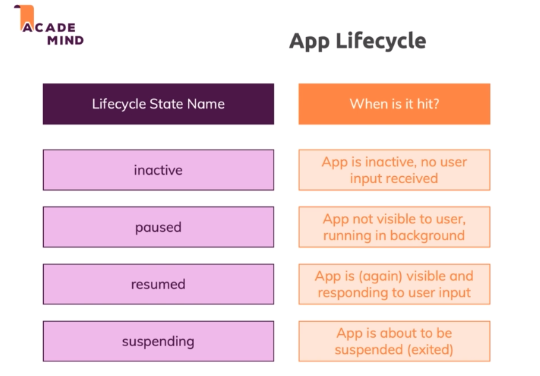

### 150. Understanding Context
Explica que el contexto es una propiedad de todos los widgets mediante el cual puede acceder a datos de otras partes del arbol de widgets sin necesidad de transferir esos datos por todos los construcores de todos los widgets.

### 151. A Problem with Lists & Stateful Widgets
Explica un problema que hay con las listas y los widgets con estados dando un ejemplo en nuestra aplicación.

### 152. Understanding the Problem Root
Explica que el problema viene por parte de flutter ya que compara el tipo de elemento de la lista y al considerar que son el mismo elemento mantiene el estado del widget.

### 153. Using Keys
Explica como usar la propiedad key como elemento diferenciador y a comparar al eliminar un widget entre widgets del mismo tipo para evitar así errores.

### Cuestionario 13: Keys, Lists, Stateful Widgets
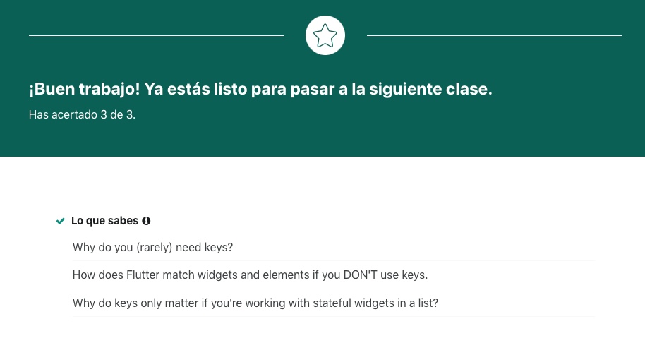

### 154. Wrap Up
Resumen de los dado en esta sección.

### 155. Useful Resources & Links
Recursos y links interesantes para complementar lo dado.

## Sección 7: Navigation & Multiple Screens [MEALS APP]

### 156. Module Introduction
Explica lo que haremos en este nuevo modulo.
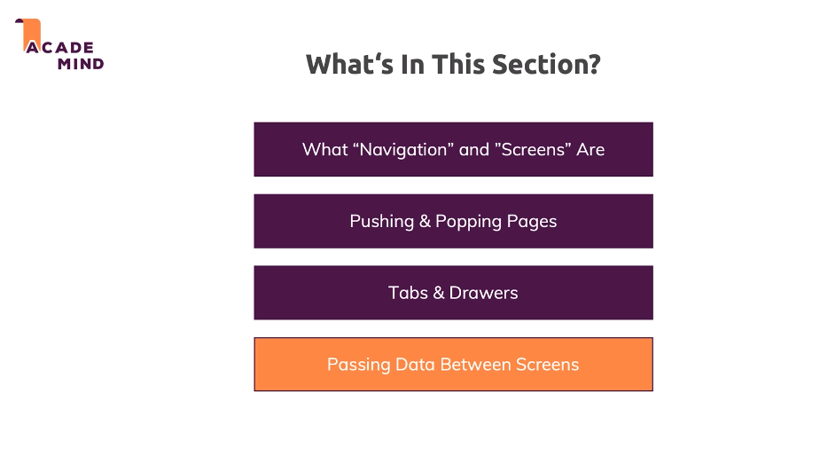

### 157. Planning the App
Planificamos la App que se va a crear en esta sección.
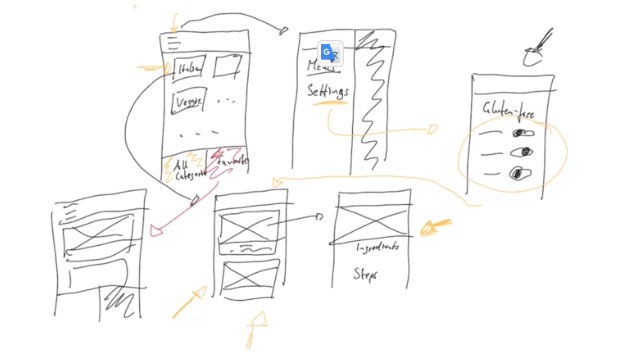

### 158. Starting With The App - Adding Base Data
Creamos la clase category y creamos una clase que provee de los datos que usaremos para las categorias de la aplicación.

### 159. Creating a Grid & Working with Linear Gradients
Creamos las celdas en nuestro objeto category item. Les damos degradados como fondo para así trabajar con estos  y despues desplegamos nuestra lista de información en el gridview como widgets del tipo que acabamos de crear.

### 160. Registering a Screen as the Main Screen
Explica como hacer que una pantalla sea la principal de la aplicación.

### 161. Styling & Theming
Damos estilo a la página añadiendo tipografías y color de fondo.

### 162. Navigating to a New Page
Explica como hacer que cada una de las tarjetas te lleve a una categoría.

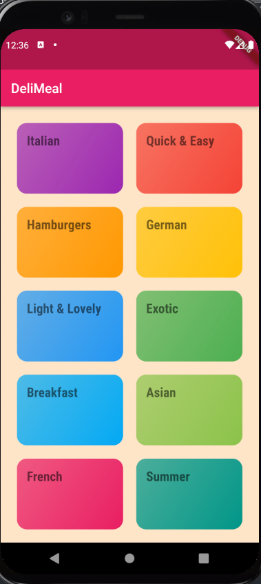

### 163. Passing Data via the Constructor
Explica como pasar el titulo a la segunda pantalla.

### 164. Using Named Routes & Passing Data With Named Routes
Explica como usar las routas con nombre y pasar información a través de los argumentos.

### Cuestionario 14: Screens & Navigation
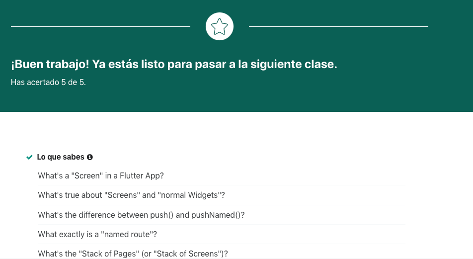

### 165. Diving Deeper into Named Routes
Explica como poner un nombre como propiedad estática y constante en la clase a la que se quiere dirigir y así tener localizado en un solo sitio la dirección.

### 166. Adding a Meal Model & Data
Añadimos una clase tipo meal y la informacion al archivo dymmu data.

### 167. Selecting Meals for a Chosen Category
Nos explica como filtrar las comidas por categoria  .contains.

### 168. Displaying Recipe Items & Using Network Images
Ordenamos en paquetes los widgets y screens. Mostramos en cada categoría fichas de la comida de momento solo cargando imagenes desde internet.

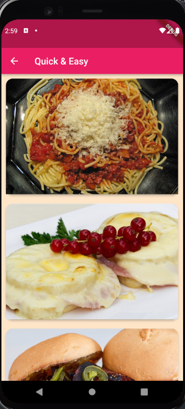

### 169. Finishing the Meal List Item
Maquetamos mejor la ficha de cada comida y aprendemos como pasar de una enum a un texto.

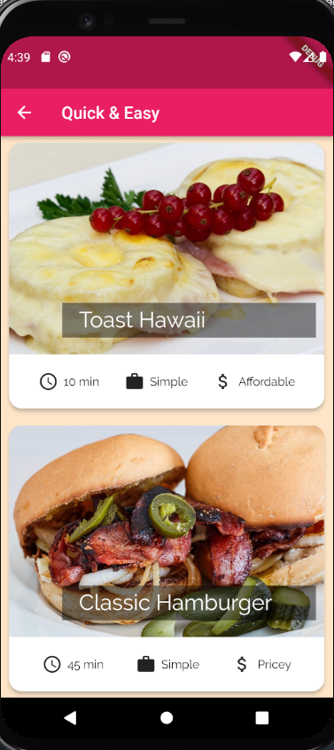

### 170. Navigating to the Meal Detail Page
Empezamos a desarollar la pantalla de detalles de los alimentos.

### 171. onGenerateRoute & onUnknownRoute
Explica la propiedad onGenerateRoute que toma una función que ejecuta cada vez que se llame a una ruta y onUnknowRoute  que sirve para hacer una página que se muestre en caso de que la routa a la que se acceda no exista (como un 404).

### Cuestionario 15: More Navigation!
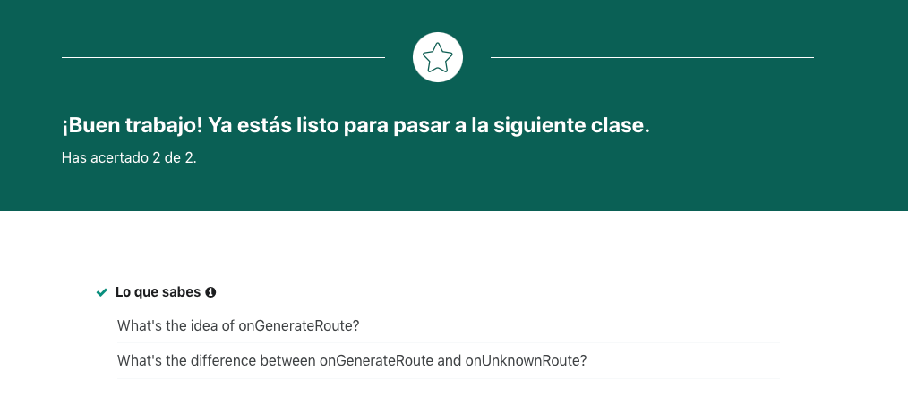

### 172. Finishing the Meal Detail Page
Terminamos la pantalla de especificaciones de alimentos donde ponemos una lista de ingredientes y una lista de pasos para llevar la receta acabo.

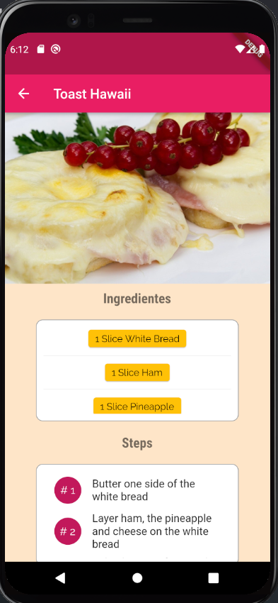

## 29/09/21

### 173. Adding a TabBar to the Appbar
Añadimos una screen de tab en la que hay dos pestañas uina de categorías y una de favoritos y segun lo que se pulse mostrar una pantalla en lel body de la misma u otro.

### 174. Adding a Bottom TabBar
Añadimos una barra de pestañas en la parte de abajo de la aplicación en vez de en la de arriba, y aunque parezca fácil se hace de una manera completamente diferente y gestionas tu las pulsaciones en los diferentes iconos y que la pantalla se cambie.

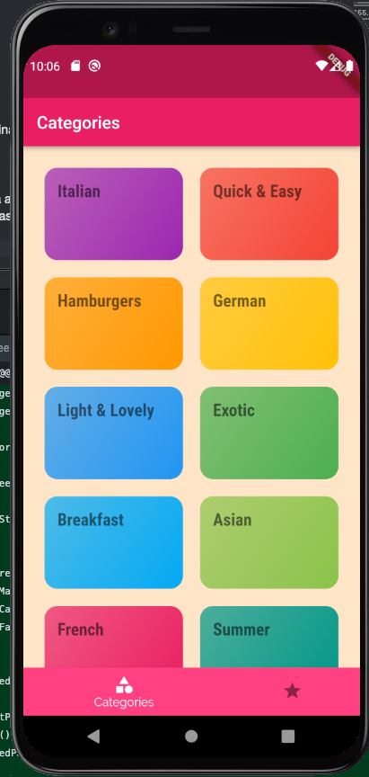

### 175. Adding a Custom Drawer
Aprendemos como hacer nuestro propio cajón a la izquierda  y añadirlo a la pantalla.

### 176. Adding Links to the Drawer
Añadimos link a nuestro ""cajon" para que cada uno de los widgets que ponemos nos lleve a una pantalla.

### Cuestionario 16: Tabs & Drawers!

### 177. Replacing Pages (Instead of Pushing)
Enseña como remplazar la pantalla a la hora de pushearla en lugar de dejarla en el stack de memoría y así evitar problemas de memoria.

### 178. Popping Pages & Passing Data Back
Explica como volver a la pantalla anterior y devolver datos al hacer esa devolución. Para hacerlo añade a la aplicación un botón de borrado de comidas.

### Cuestionario 17: Replacing, Popping & Data
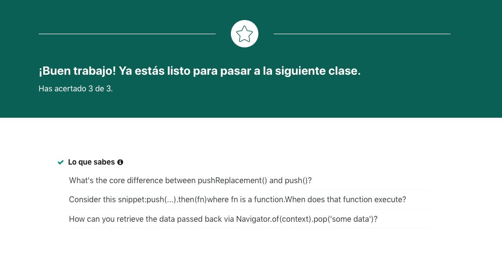

### 179. Adding Filter Switches
Añade switches en la pantalla de filtros para controlar las booleanas.

### 180. Adding Filtering Logic
Añade la lógica necesaria para utilizar los filtros.

### 181. Adding a "Mark as Favorite" Feature
Se añade un botón de favorito en los alimentos y se hace que se muestre en la sección de favoritos.

### 182. A Problem!
Habla del problema que da que la página de favoritos este cacheada, por que al borrar un favorito y volver sigue estando ahi la comida a la que hemos quitado 

### 183. Wrap Up
Resumen de lo dado en la sección.

### 184. Useful Resources & Links
Links y adjuntos de interes.

## 13/10/21

## Sección 8: State Management [SHOP APP]

### 185. Module Introduction
Introducción a este modulo en el que enseña la app que haremos.

### 186. Planning the App
Planificamos la app con un dibujo de como será y las pantallas que tendrá.

### 187.Defining a Data Model
Definimos la clase producto para empezar a hacer su screen.

### 188. Working on the "Products" Grid & Item Widgets
Diseñamos las cuadriculas para cada uno de los productos.

## 14/10/21

### 189. Styling & Theming the App
Explica de nuevo como poner otras tipografías y como poner los bordes redondos de las tarjetas de los productos.

### 190. Adding Navigation to the App
Aprendemos a usar GestureDetector para que cada uno de los articulos nos lleve a su propia pantalla de detalles (también creamos esta) y a utilizar las routas de una mannera más dinámica.

### 191. Why State Management? And what is "State" and "State Management"?
Explica como el estado aydua a gestionar los datos que afectan a varios partes del programa.

