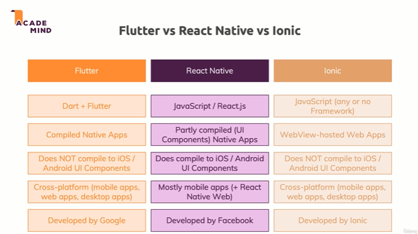
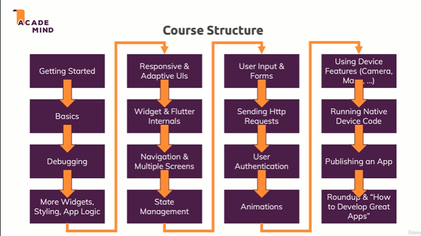
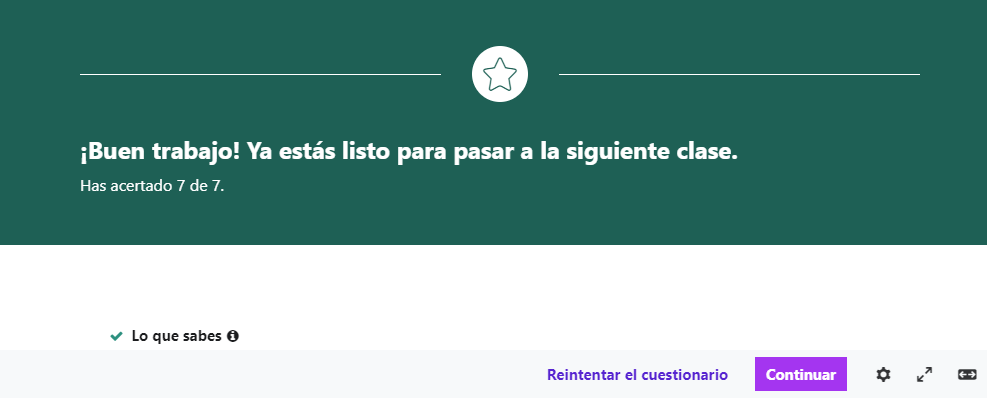
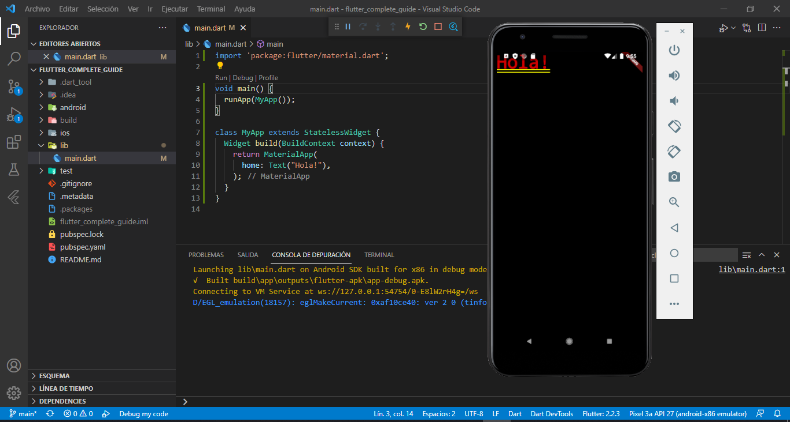
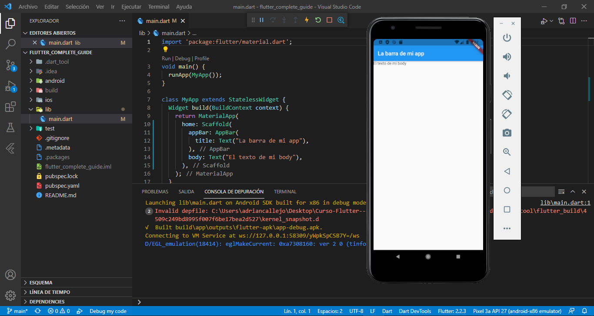
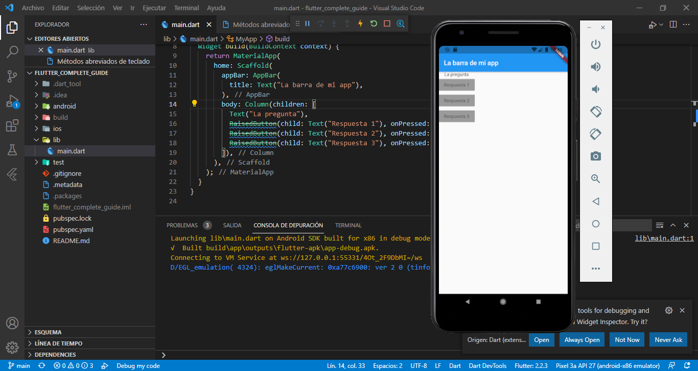
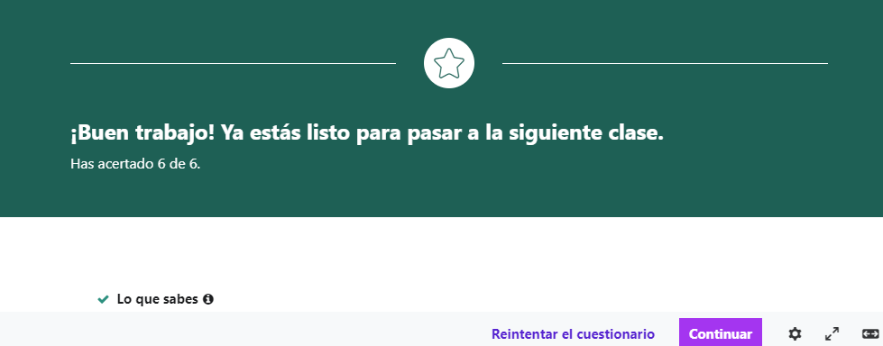
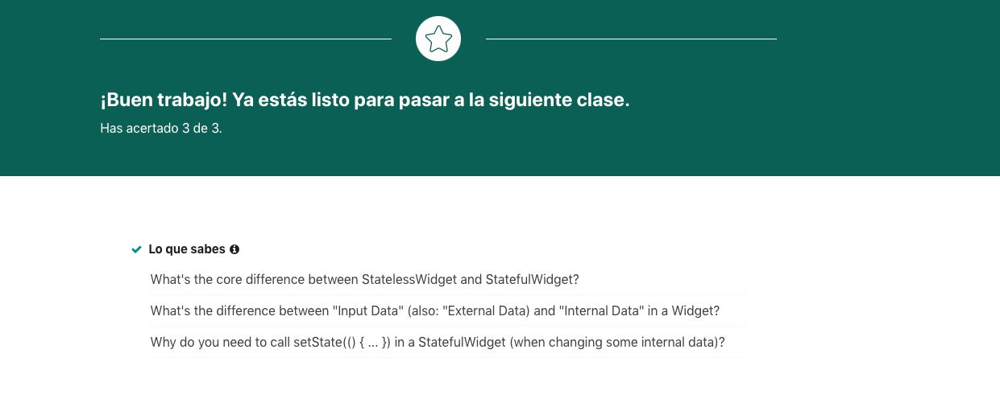

# Curso:  
## Flutter & Dart - The Complete Guide [2021 Edition]
# Plataforma:
## udemy

# 01/09/21:

## Sección 1: Introduction

### 1. Introduction
Explica en que consistirá el curso y habla de que se van a tener que programar aplicaciones durante el transcurso del mismo.

### 2. What is Flutter?	
Explica que Flutter es una herramienta que permite programar aplicaciones multiplataforma de manera nativa para cada una de estas en un mismo lenguaje, Dart. 
Habla de las ventajas de esto, como programar solamente una vez para las diferentes plataformas o aprender un solo lenguaje.
Flutter tiene un SDK que permite compilar para las diferentes plataformas. Además, proporciona un framework que se usará para crear las aplicaciones. 
También explica que Dart es un lenguaje enfocado en la creación, de manera sencilla, de frontends, orientado a objetos, tipado y su sintaxis es una mezcla de Javascript, Java y C#.

### 3. Join our Online Learning Community	
Texto donde anima a unirse a un canal de Discord para formar parte de una comunidad.

### 4. Understanding the Flutter Architecture
Habla de la estructura basada en widgets de Flutter, de como esta se programa solamente con código (no visualmente) y de que se puede crear código para que cuando la aplicación se compile para Android actue de una manera y cuando se compile para iOs de otra.
Una aplicación está basada en un árbol de widgets en donde unos contienen a otro, donde los últimos widgets puede ser los botones, entradas de texto… 
Aunque no se pueda programar “arrastrando” de manera visual widgets, si que puedes ver una vista previa del código. 

### 5. How Flutter & Dart Code Gets Compiled To Native Apps
Habla de lo anteriormente comentado, de que flutter compila el codigo para las diferentes plataformas y especifica que las aplicaciones tienen un alto rendimiento.
Flutter no compila su codigo con alguna equivalencia nativa de las plataformas (por ejemplo poniendo un boton en flutter no se llama al boton de ios, o android), controla cada pixel y esto da mucho control y flexibilidad sobre lo que se quiere programar. 

### 6. Understanding Flutter Versions
Habla de que flutter se actualiza constantemente para arreglar errores, mejoras o también algunos cambios que ni si quiera el programador aprecia.

### 7. Flutter macOS Setup

### 8. macOS Development Environment
No dispongo de equipo para seguir estas explicaciones.

### 9. Flutter Windows Setup
Siguiendo las instrucciones de esta web explica como instalar Flutter: https://flutter.dev/docs/get-started/install/windows

## 06/09/21:

### 10. Windows Development Environment
Explica como crear un proyecto de Flutter a través de la consola, como instalar vs code, las extensiones que hay que instalar para programar comodamente y como abrir el proyecto.
Deja un par de archivos de configuración en la carpeta recursos para así poder tener configurado el proyecto de la misma manera que el curso.
Explica como ejecutar el proyecto en el emulador AVD de android a través del terminal y a través de VS CODE. 
También explica como ver los cambios "en caliente" de las dos maneras.

### 11. Flutter & Material Design
Habla de flutter utiliza mucho Material Design, que es de Google, pero que material design también se puede usar con apple y que también enseñara a utilizar las herramientas de apple.

### 12. Flutter Alternatives
Compara Flutter con React Native y a su vez con Ionic. De manera resumida cuenta que la gran ventaja de Flutter es el hecho de que las aplicaciones se compilen para ser nativas en cada dispositivo y la flexibilidad y eficiencia que da esto a las mismas.

### 13. Course Outline
Habla de la estructura del curso y de lo que se va a estudiar.

### 14. How To Get The Most Out Of The Course
Aconseja como llevar el curso. (A tu ritmo, programando tu solo, preguntando y ayudando a la comunidad...)

## 09/09/21

## Sección 2: Flutter Basics [QUIZ APP]

### 16. Module Introduction
Habla de que esta sección va a ser larga ya que debe ajustarse a los programadores más expertos y los novatos. 
En esta sección veremos:
1. Como una app Flutter se inicia y funciona.
2. Trabajaremos con widgets y crearemos widgets personalizados.
3. Como reaccionar ante eventos del usuario.
4. Diferencia entre widgets con estado y widgets sin estado.
5. Fundamentos de Dart.

### 17. Creating a New Project
Creamos un proyecto a través de la consola de comandos. Explica como se crea y ejecuta un proyecto de flutter desde vs code (de nuevo).

### 18. An Overview of the Generated Files & Folders 
Explica la funcionalidad de cada una de las carpetas generadas por flutter al crear el proyecto. La mayoría como "Android", "build" o "ios" son pasivas y no debemos cambiar nada en ellas. Sin embargo "lib" es donde programaremos y "test" es una carpeta que usaremos en el futuro para hacer pruebas. "pubspec.yaml" es donde administraremos las dependencias del proyecto como paquetes de terceros, imagenes o tipografías.  

### 19. More on Git (Version Control System)
Contiene un link donde ver aprender para que sirve y como funciona git.

### 20. Analyzing the Default App
Explica con el codigo que todo son widgets, que hay widgets creados por flutter y widgets creados por nosotros, y que también podremos combinar widgets. Al final del video borra todo el codigo para que aprendamos dart desde 0.

### 21. Dart Basics
Explica conceptos básicos de dart, como lo que es una función, que es un lenguaje tipado, que la funcion main es la función que usa como entrada a la aplicación, que las funciones para su nomemclatura utilizando camel case, como llamar a funciones, que hay que usar punto y coma despues de cada función... 

## 10/09/21

### 22. More Dart Basics
Explica como crear variables en dart y el uso de 'var'. Explica también que todo en DART es un objeto y como inicializarlos (sin usar new) y cambiar sus propiedades.

### 23. Dart Basics - Summary
Resumen en PDF de los dos modulos anteriores.

### Cuestionario 1: Dart Fundamentals

### 24. Building an App From Scratch
Volvemos a programar en el proyecto que creamos anteriormente y explica lo que es la herencia y los import.Explica como hacer el constructor de un widget basado en material.

### 25. Running the App on an Emulator
Explica como usar la función runApp para llamar a un objeto de la clase creada anteriormente y ver en el emulador la aplicación.

### 26. Class Constructors & Named Arguments
Explica como hacer y para que sirve un constructor y sus argumentos. Explica como funcionan los argumentos con nombres (opcionales), cuando quieres que un argumento opcional sea obligatorio (EN FLUTTER no en DART) tienes que ponerle delante @required. Explica también como hacer un constructor de manera más corta, ej: PErson({this.name,this.age});

### 27. First Summary & Additional Syntax
Resume lo que dimos y explica que opcionalmente se puede poner @override antes de la función sobrescrita para hacer un codigo más limpio.También explica como resumir una función con solo una expresion ej: void main() => runAPP(MyApp());

### Cuestionario 2: Flutter App Basics

### 28. Building a Widget Tree
Explica el objeto Scaffold (que da un diseño básico estructura y esquema de color para una interfaz de usuario). Explica que a Scaffold le podemos pasar widgets de lo que queramos modificar, por ejemplo AppBar a la que a su vez se le pasa un titulo, o un widget body. Explica donde debemos poner ',' para programar de una manera más legible.

## 11/09/21

### 29. Visible (Input / Output) & Invisible (Layout / Control) Widgets
Explica la diferencia entre los widgets visibles que están relacionados con la entrada o salida de datos cara al usuario (botones, textos...) e invisibles donde controlamos cosas como el layout y la estructura de widgets (filas,columnas,Listview..).

### 30. Adding Layout Widgets
Explica el concepto de listas en Dart, como meter una lista de widgets dentro de un widget del tipo columna, y como hacer botones con el widget RaisedBoton.

### Cuestionario 3: Widget Basics

### 31. Connecting Functions & Buttons
Explica como conectar las funciones con los botones, básicamente en el Onpressed: se llaman sin parentesis, si no se ejecutarian en el momento.

### 32. Anonymous Functions
Explica como programar funciones anonimas: si son simples "() => print("HOLA")" si la función usa varias lineas se usan los corchetes "(){print("HOLA");print("Esto es otra linea de codigo");}

### 33. Updating Widget Data (Or: Using StatelessWidget Incorrectly)
Explica como NO cambiar el texto a través de un boton :rage: :shit:

## 20/09/21

### 34. [DART DEEP DIVE] Understanding Lists
Explica el concepto de listas.	

### 35. Updating Correctly with Stateful Widgets
Explica lo que es el estado de un widget y cual es la diferencia entre un widget con estado y uno sin. También explica como programar y enlazar un widget con estado. 

### Cuestionario 4: Stateful & Stateless Widgets

### 36. A Brief Look Under The Hood
Explica como funciona internamente la función SetState().

### 37. Using Private Properties
Explica los niveles de acceso a las propiedades desde los otros archivos/librerias (el concepto de privado) 
Para convertir una propiedad o clase en privada en dart se le pone una barra baja antes del nombre ej: 
variable1 sería publica _variable1 sería privada.

### 38. Creating a New, Cuestom Widget
Explica como hacer una clase widget y acceder a ella desde otra clase.

### 39. First Styling & Layouting Steps
Explica algunas propiedades de estilo que se le pueden pasar al constructor de un text, lo que es una enumeración, que puede haber diferentes tipos de constructores...

### 40. Enums & Multiple Constructors 
Explica de manera más extendida lo que es una enumeración y la posibilidad de usar multiples constructores en dart.

### 41. Official Docs & The Widget Catalog
Explica la utilidad de la documentación de Flutter y donde encontrarla.

### 42. Styling Buttons & Passing Callback Functions Around
Explica como usar el RaisedButton en vez del ElevatedButton.

### 43. Passing Callback Functions Around 
Explica como pasar una función en un constructor. Además hacemos nuestro propio widget "Answer".

### 44.Introducing Maps

 
